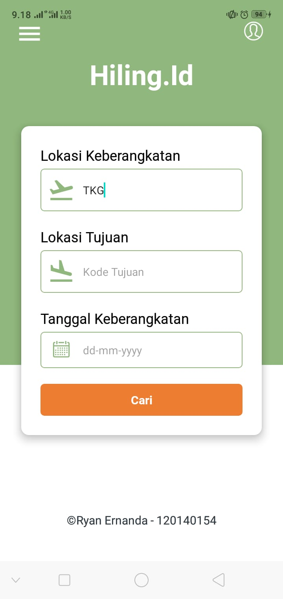
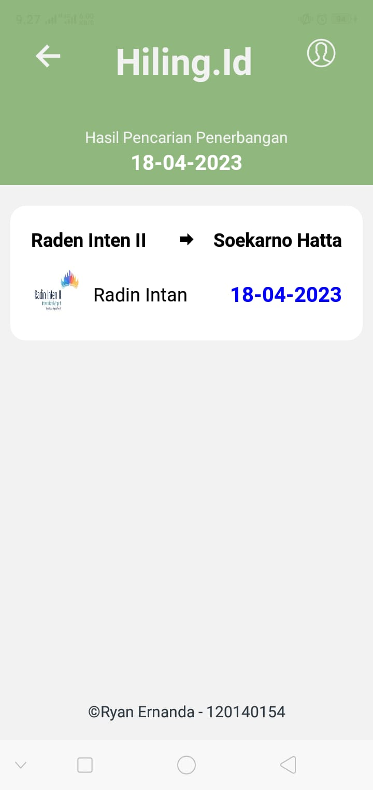

# HILING.ID Ryan Ernanda - 120140154
Download apk hiling <a href="https://expo.dev/artifacts/eas/uCQa6KxcKqu36U92s19prY.apk">di sini</a>.

## Halaman Pencarian


## Halaman Hasil Pencarian


## Library
- React Native
- Expo
- React Native Vector Icons

## Sturktur Folder
```
/
├─ assets/          # Semua data gambar
├─ src/             
│  └─ Data.js       # File data untuk menyimpan data penerbangan
│  └─ Detail.js     # File detail untuk menampilkan hasil pencarian
│  └─ Home.js       # File home untuk menampilkan form pencarian
│  └─ logo.js       # File logo untuk load gambar
│
├─ App.js           # file utama untuk merender semua file 
├─ .gitattributes
├─ .gitignore
├─ README.md
├─ app.json
├─ babel.config.json
├─ eas.json
├─ package-lock.json
├─ package.json
```

## Cara menjalankan
- Clone Repository ini
- Install React dan Expo
- Masuk Kedalam directory utama dan jalankan
```
npm install
```
atau
```
npm install -f
```
- tunggu hingga proses selesai
- jika ingin di jalankan dengan android maka gunakan syntax berikut 
```
npm run android
``` 
- jika ingin di jalankan dengan website maka gunakan syntax berikut dan ikuti perintahnya karena ada library tambahan yang harus di install
```
npm run web
```

